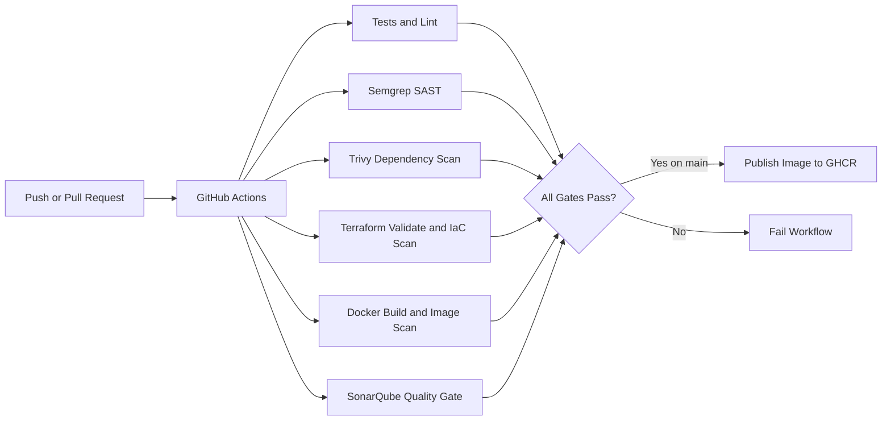

# DevSecOps CI/CD Pipeline

This project contains a Node.js/Express API and a GitHub Actions pipeline that runs security and quality checks automatically.

The pipeline checks:

- application tests and linting
- SAST with Semgrep
- dependency CVE scanning with Trivy
- Terraform/IaC validation and scanning
- Docker image build and vulnerability scanning
- code quality gate with SonarQube Cloud
- Docker image publishing to GHCR after all gates pass

## Architecture



## Stack

- Node.js 24 LTS and Express
- Jest, Supertest, and ESLint
- Docker and Docker Compose
- GitHub Actions
- Semgrep Community Edition
- Trivy
- Terraform CLI
- SonarQube Cloud
- GitHub Container Registry

## API

```text
GET /health
GET /api/status
```

## Run Locally

```powershell
npm ci
npm run lint
npm test
npm start
```

Open:

```text
http://localhost:3000/health
http://localhost:3000/api/status
```

Stop the server with `Ctrl+C`.

## Run with Docker

```powershell
docker compose up --build
```

Open:

```text
http://localhost:3000/health
```

Stop Docker Compose with `Ctrl+C`.

## Local Security Verification

Run:

```powershell
.\scripts\verify-local.ps1
```

This runs the main local checks: install, lint, tests, Docker build, Trivy scans, Terraform validation, and Terraform plan.

## GitHub and SonarQube Cloud

Create a public GitHub repository and import it into SonarQube Cloud.

Add these GitHub Actions settings:

- Secret: `SONAR_TOKEN`
- Variable: `SONAR_ORGANIZATION=<your SonarQube Cloud organization key>`
- Variable: `SONAR_PROJECT_KEY=<your SonarQube Cloud project key>`
- Optional variable: `SONAR_BRANCH_NAME=<SonarQube Cloud main branch name, only if different>`

The workflow fails if the required SonarQube values are missing.

## Workflow Triggers

The workflow runs on:

- push to `main`
- push to `demo/**`
- pull request to `main`
- manual run from the GitHub Actions tab

Only `main` publishes the Docker image after all gates pass:

```text
ghcr.io/<owner>/<repo>:<git-sha>
ghcr.io/<owner>/<repo>:latest
```

## Documentation

Start here:

```text
docs/setup/START_HERE.md
```

Useful references:

```text
docs/setup/RUN_LOCALLY.md
docs/setup/GITHUB_AND_SONAR_SETUP.md
docs/setup/DEMO_STEPS.md
docs/setup/STACK_EXPLAINED.md
docs/setup/PROJECT_SUBMISSION_GUIDE.md
```
